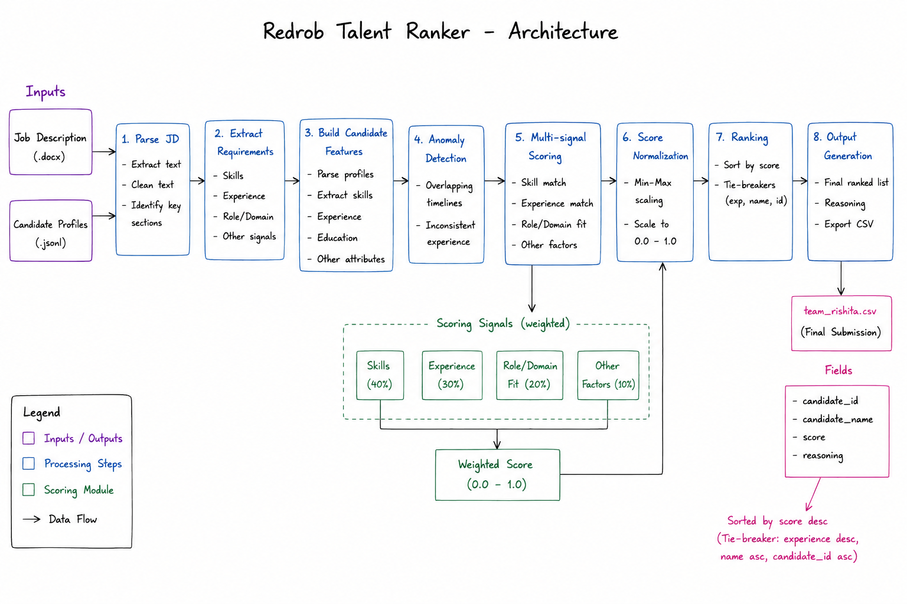

# Redrob Talent Ranker — Team Rishita

An automated candidate ranking engine developed for the Redrob Talent Analytics Hackathon. The system parses a job description, evaluates candidate profiles using multiple scoring signals, performs profile consistency checks, and generates a ranked candidate list in the required submission format.

---

## Overview

The ranking pipeline is designed to:

- Parse job descriptions directly from `.docx` files.
- Extract relevant keywords, title signals, location preferences, and experience requirements dynamically.
- Evaluate candidate profiles using experience, skills, work history, education, and platform engagement metrics.
- Perform consistency checks on candidate profiles to identify potentially unreliable records.
- Generate deterministic rankings and stable reasoning outputs.
- Export results in the exact format required by the competition.

---

## Features

### Dynamic Job Description Parsing
The system automatically extracts:
- Relevant technical keywords and frequency metrics
- Target job titles and core designators
- Experience range boundaries
- Location preferences and remote work indicators

This architecture makes it adaptable to different job descriptions without requiring manual skill configuration.

### Candidate Evaluation Engine
Candidate scores are calculated using:
- Years of experience alignment window
- Open-ended keyword vocabulary relevance
- Career history and trajectory analysis
- Title token density matching
- Academic institution and education profile indicators
- Company background and industry signals
- Platform engagement metrics and notice period availability

### Profile Consistency Checks
The pipeline performs validation checks including:
- Excessive skill-to-experience proficiency mismatches
- Significant concurrent employment timeline overlaps
- Skill duration inconsistencies relative to reported experience

These checks help reduce the influence of potentially unreliable or anomalous profiles.

### Deterministic Output Generation
The ranking process is deterministic:
- Stable scoring using fractional min-max scalar calibration (0.0 to 1.0 spectrum)
- Stable multi-key sorting rules (Score Descending -> Candidate ID Ascending)
- MD5-based hashing for consistent reasoning bucket assignment across different environments

---

## Repository Structure

```text
.
├── rank.py                  # Master operational pipeline deployment script
├── README.md                # System documentation
├── requirements.txt         # Pip package dependency constraints
├── submission_metadata.yaml # Completed team identity metrics
├── validate_submission.py   # Official hackathon format verification script
└── data/                    # Local verification sandbox store
    ├── raw/
    │   ├── candidates.jsonl # User-provided competition dataset (not included)
    │   └── job_description.docx # Target job description specification document
    └── outputs/
        └── team_rishita.csv # Validated candidate ranking output matches (100 rows)
        
```

---

## Execution Guide

> **Note on Dataset Access:** Due to GitHub's file size constraints (>100MB), the raw dataset file `candidates.jsonl` has been excluded from this repository via `.gitignore`. To replicate or run this pipeline locally, please place your official competition dataset file inside the `data/raw/` directory before execution.
To execute the core engine pipeline and update the candidate rankings, run the following command from the root directory:

```bash
python rank.py --candidates data/raw/candidates.jsonl --jd data/raw/job_description.docx --out data/outputs/team_rishita.csv
```
To verify that the output structure perfectly conforms to the official hackathon schema rules, execute the validation script:

```bash
python validate_submission.py data/outputs/team_rishita.csv
```
To boot up the interactive Streamlit UI dashboard locally, execute:
```bash
streamlit run app.py
```

## Architecture Diagram

